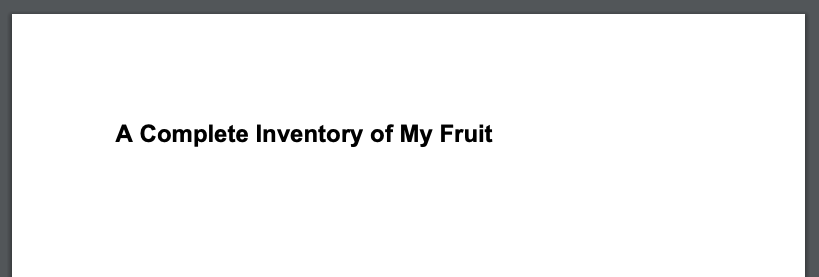
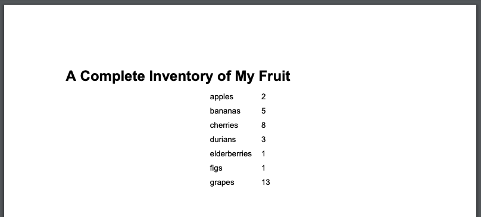

# Automating Real-world Tasks with Python

## Course 6 Introduction

This last course will give you the opportunity to put all this new knowledge in action. You'll be given a bunch of small projects based on real-life scenarios, and you'll use Python to write the automation that will solve the challenges.

## Application Programming Interfaces

This module will help you put to practice some of your newly acquired Python skills. You'll make use of interesting Python libraries, understand how to read their APIs, and learn how to use the Python Imaging Library (PIL).

By the end of this module, you'll build a program that automatically resizes and rotates a bunch of images, and converts them from one image format to another.

### Built-In Libraries vs. External Libraries

As we covered in an earlier course, the Python Standard Library comes as part of the Python installation and includes modules for the most common tasks you can do with Python. But there's tons of other things you might want to do in your scripts, and not all of them are in the standard library. This is where external modules come into play. When developers write a Python module that they think others might find useful, they publish it in **PyPI** -- also known as the **Python Package Index** (<https://pypi.org>). We can browse this repository of Python modules to find the module we need. It includes thousands of projects, which are classified by different categories, like topic, development status, and intended audience.

In this module, we’re going to be **transforming** and **converting** images. To do that, we'll be using a popular library for image manipulation: the **Python Imaging Library (PIL)**. The original PIL library hasn't been updated since 2009 and does not support Python 3. Fortunately, there's a current fork of PIL called **Pillow**, that properly supports Python 3 and is kept up-to-date. The Pillow library is packaged with the name pillow, but the module name in Python is still PIL.

### What is an API?

Application Programming Interfaces (APIs) help different pieces of software talk to each other. When you write a program, you typically use a bunch of existing libraries for the programming language of your choice. These libraries provide APIs in the form of **external** or **public** functions, classes, and methods that other code can use to get their job done without having to create a lot of repeated code.

And not only that, APIs can also be used by other pieces of software, even if they were written in a completely different programming language. For example, Cloud services use APIs that your programs can communicate with by making web calls. What’s special about an API? What makes it different to any other function that you would write in your own code?

If you look at the library's code, you’ll find it has many functions that we're not meant to use directly from our code. These **internal** or **private** functions, classes, and methods do important work, but they’re there to support the functions that are published by the library. You probably don't have time to dig in to understand every little bit of how the code works, but you need to know how to interact with the library to do useful work. An API is sort of like a promise. Even if the library's internal code changes, you expect the function to keep accepting the same parameters and returning the same results. That provides a stable **interface** to write your code with. That's an API!

Library authors are free to make improvements and changes to the code behind the interface, but they shouldn't make changes to the way the functions are called or the results they provide. Because this would break the code that depends on that library. When a library author needs to make a **breaking change** to an API, then they need to have a plan in place for communicating that change to their users. [That's why breaking changes should be saved for major version increments of a library](https://semver.org/#summary).

_**When you choose a certain library to use with your code, the first step is to get familiar with its API. You'll need to look at how the functions are called, what inputs they expect, and what outputs they'll return**_.

### How to Make Sense of an API?

How do you learn to use a library or an API that you’ve never worked with before? It might take you a bit of time to familiarize yourself with how the library operates, but that's okay. It's worth spending some time understanding the way the functions are organized, the inputs and outputs, and the general expectations of the library.

In general, a good API should be descriptive. You should be able to look at a function's name and have a pretty good idea of what it will do. A well-designed API will follow patterns and **naming conventions**. That means that the functions, classes and methods should have names that help you understand what to expect from them. And when the name isn’t enough, you should have access to the documentation for each of the functions that will help you figure out what they do.

For example, when we visit the [reference page for the Image object](https://pillow.readthedocs.io/en/stable/reference/Image.html) in Pillow, we see this piece of example code:

```python
from PIL import Image
im = Image.open("bride.jpg")
im.rotate(45).show()
```

This piece of code is pretty straightforward. Even without having seen this library before, you can probably guess that it opens an image called bride.jpg, rotates it 45 degrees, and then shows it on the screen.

But how can we know for sure? We can look up each of the functions in the documentation and check what they’re supposed to do. When dealing with open-source libraries, we can even check out how the function is implemented to see if it matches our expectations. For a web service API or a closed-source library, you might not have access to the underlying code, but you should have access to the documentation that’s generated by the code.

For a Python library like PIL, the code is documented using **docstrings**. If you remember from waaaay back in our first course, docstrings are documentation that lives alongside the code. You've been using them ever since! When you use “help()” to describe a function, or read a description of what a Python function does in your IDE, what you’re reading comes from docstrings in the code.

For example, let's take a look at the documentation for PIL:

```python
import PIL
help(PIL)
```

Lots of Python modules also publish their documentation online. Pillow's full documentation is published [here](https://pillow.readthedocs.io/). There, the docstrings have been compiled into a browsable reference, and they’ve also written [a handbook](https://pillow.readthedocs.io/en/stable/handbook/index.html) with [tutorials](https://pillow.readthedocs.io/en/stable/handbook/tutorial.html) for you to get familiar with the library's API. Woohoo!

## Manipulating Images

### How to Use PIL for Working With Images

As we've mentioned, for the project in this module, you'll use the Python Imaging Library to process a bunch of images. So, how does that work?

When using PIL, we typically create Image objects that hold the data associated with the images that we want to process. On these objects, we operate by calling different methods that either return a new image object or modify the data in the image, and then end up saving the result in a different file.

For example, if we wanted to resize an image and save the new image with a new name, we could do it with:

```python
from PIL import Image
im = Image.open("example.jpg")
new_im = im.resize((640,480))
new_im.save("example_resized.jpg")
```

In this case, we're using the resize method that returns a new image with the new size, and then we save it into a different file. Or, if we want to rotate an image, we can use code like this:

```python
from PIL import Image
im = Image.open("example.jpg")
new_im = im.rotate(90)
new_im.save("example_rotated.jpg")
```

This method also returns a new image that we can then use to create the new rotated file. Because the methods return a new object, we can even combine these operations into just one line that rotates, resizes, and saves:

```python
from PIL import Image
im = Image.open("example.jpg")
im.rotate(180).resize((640,480)).save("flipped_and_resized.jpg")
```

There's a ton more that you can do with the PIL library. Have a look at [the docs](https://pillow.readthedocs.io/en/stable/handbook/tutorial.html) and try it on your computer!

## Module 1 Project

### Project Problem Statement

To complete this module, you'll need to write a script that processes a bunch of images. It turns out that your company is in the process of updating its website, and a design contractor has been hired to create some new icon graphics for the site. However, the contractor has delivered the final designs and they’re in the wrong format, rotated 90° and too large. You’re unable to get in contact with the designers and your own deadline is approaching fast. You’ll need to use Python to get these images ready for launch!

So, how will you do this? You'll need to go through a folder full of images and operate with each of them. On each image, you'll use PIL methods like the ones we saw in the examples, and then write the new images in the right place.

If this sounds tricky, don't panic! You've already seen everything you need to do this, and now it's time to put it into practice.

## Interacting with Web Services

In this module, we'll look into a bunch of different tools that can be really useful in today's IT world. You'll first learn how you can use different text formats to store data in text files, retrieve it, and even transmit it over the internet.

Later on, we'll look into how we can get our code to interact with services running on different computers using a module called Python Requests.

### Web Applications and Services

A **web application** is an application that you interact with over HTTP. Most of the time when you’re using a website on the Internet, you’re interacting with a web application. So, how does this look behind the scenes?

Your web browser sends an HTTP request to a web server. Then, the web server passes the request along to the web application in charge of deciding what information to show you. The application then generates the website content (in HTML format). The application is also in charge of serving images and any other necessary data so that your web browser can render the website on your computer.

Lots of **web applications** also have APIs that you can use from your scripts! Web applications that have an API are also known as web services. Instead of browsing to a web page to type and click around, you can use your program to send a message known as an **API call** to the web service. The part of the program that listens on the network for API calls is called an **API endpoint**.

When you interact with a web service like this, you don't even care what language the other application is using. You interact with it using a specified protocol, and the only important constraint is that both the service and your program know how to use this protocol.

### Data Serialization

If you have two programs that need to communicate with each other, how do you get that data from one place to another? We're going to talk about two aspects of that problem: what to send, and how to send it.

First, what do you send? When you have a conversation with another person, you don't send thoughts and memories directly between your brains. At least not yet! You first have to convert your thoughts into language, and then transmit that language to another person. They take that language, and convert it back into thoughts. It’s the same with programs running in different places, or at different times.

In a previous course, we took a list of lists in memory and wrote it to disk as a Comma-Separated Value (CSV) file. This is one example of a technique called data serialization. Data serialization is the process of taking an in-memory data structure, like a Python object, and turning it into something that can be stored on disk or transmitted across a network. Later, the file can be read, or the network transmission can be received by another program and turned back into an object again. Turning the serialized object back into an in-memory object is called deserialization.

Data serialization is extremely useful for communicating with web services. A web service's API endpoint takes messages in a specific format, containing specific data. By the end of this module, we'll be sending messages to web services, but for now let's concentrate on how to serialize Python objects into some common formats.

Let's start with the contact information from one of our CSV examples. We'll keep just two entries to keep our examples short, but there's no limit to how long these can be.

```text
name,username,phone,department,role
Sabrina Green,sgreen,802-867-5309,IT Infrastructure,System Administrator
Eli Jones,ejones,684-3481127,IT Infrastructure,IT specialist
````

Instead of having a list of lists, we could turn this information into a list of dictionaries. In each of these dictionaries, the key will be the name of the column, and the value will be the corresponding information in each row.  It could look something like this:

```text
people = [
    {
        "name": "Sabrina Green",
        "username": "sgreen",
        "phone": "802-867-5309",
        "department": "IT Infrastructure",
        "role": "Systems Administrator"
    },
    {
        "name": "Eli Jones",
        "username": "ejones",
        "phone": "684-348-1127",
        "department": "IT Infrastructure",
        "role": "IT Specialist"
    },
]
```

Using a structure like this lets us do interesting things with our information that’s much harder to do with CSV files. For example, let's say we want to record more than one phone number for each person. Instead of using a single string for "phone", we could represent that data in another dictionary, like this:

```text
people = [
    {
        "name": "Sabrina Green",
        "username": "sgreen",
        "phone": {
            "office": "802-867-5309",
            "cell": "802-867-5310"
        },
        "department": "IT Infrastructure",
        "role": "Systems Administrator"
    },
    {
        "name": "Eli Jones",
        "username": "ejones",
        "phone": {
            "office": "684-348-1127"
        },
        "department": "IT Infrastructure",
        "role": "IT Specialist"
    },
]
```

Now, we can record multiple phone numbers per person, and give them descriptive names like "office" and "cell". This would be hard to store in a CSV file, because the data is not flat. To help us with that, there's a bunch of different formats that we can use to store our data when the structure isn't flat.

Up next, we'll look into a few of the most common ones.

### Data Serialization Formats

There are lots and lots of ways to serialize data. In this course, we'll cover a couple of the most common ones and we'll look into how you can use them from Python. Once you get the hang of how this works, it's super easy to use a different format if needed.

[JSON (JavaScript Object Notation)](https://json.org/) is the serialization format that we'll use the most in this course. We'll go into some details later but, for now, let's just use the **json** module to convert our _**people**_ list of dictionaries into JSON format.

```python
import json

with open('people.json', 'w') as people_json:
    json.dump(people, people_json, indent=2)
```

This code uses the **json.dump()** function to _**serialize**_ the people object into a JSON file. The contents of the file will look something like this:

```json
[
  {
    "name": "Sabrina Green",
    "username": "sgreen",
    "phone": {
      "office": "802-867-5309",
      "cell": "802-867-5310"
    },
    "department": "IT Infrastructure",
    "role": "Systems Administrator"
  },
  {
    "name": "Eli Jones",
    "username": "ejones",
    "phone": {
      "office": "684-348-1127"
    },
    "department": "IT Infrastructure",
    "role": "IT Specialist"
  },
]
```

[YAML (Yet Another Markup Language)](https://yaml.org/) has a lot in common with JSON. They’re both formats that can be easily understood by a human when looking at the contents. In this example, we’re using the **yaml.safe_dump()** method to serialize our object into YAML:

```python
import yaml

with open('people.yaml', 'w') as people_yaml:
    yaml.safe_dump(people, people_yaml)
```

That code will generate a _**people.yaml**_ file that looks like this:

```yaml
- department: IT Infrastructure
  name: Sabrina Green
  phone:
    cell: 802-867-5310
    office: 802-867-5309
  role: Systems Administrator
  username: sgreen
- department: IT Infrastructure
  name: Eli Jones
  phone:
    office: 684-348-1127
  role: IT Specialist
  username: ejones
```

While this doesn't look exactly like the JSON example above, both formats list the names of the fields as part of the format, so that both the programs parsing the data and the humans looking at it can make sense out of it. The main difference is how these formats are used. JSON is used frequently for transmitting data between web services, while YAML is used the most for storing configuration values.

These are just a couple of the most common data serialization formats. We've left out some other pretty common ones like [Python pickle](https://docs.python.org/3/library/pickle.html), [Protocol Buffers](https://developers.google.com/protocol-buffers), or the [eXtensible Markup Language (XML)](https://www.w3.org/XML/). Each of them is useful in a specific context, although not the focus of this course. You can read more about them by following those links.

### More About JSON

Alright, we've seen a couple of different serialization formats. Let's now dive into more details about [JSON (JavaScript Object Notation)](https://json.org/), which you'll be using in the lab at the end of this module.

As we mentioned before, JSON is _**human-readable**_, which means it’s encoded using printable characters, and formatted in a way that a human can understand. This doesn't necessarily mean that you will understand it when you look at it, but you can.

Lots of web services send messages back and forth using JSON. In this module, and in future ones, you’ll serialize JSON messages to send to a web service.

JSON supports a few _**elements**_ of different data types. These are very basic data types; they represent the most common basic data types supported by any programming language that you might use.

JSON has _**strings**_, which are enclosed in quotes.

```json
"Sabrina Green"
```

It also has numbers, which are not.

```json
101
```

JSON has objects, which are key-value pair structures like Python dictionaries.

```json
{
  "name": "Sabrina Green",
  "username": "sgreen",
  "uid": 1002
}
```

And a key-value pair can contain another object as a value.

```json
{
  "name": "Sabrina Green",
  "username": "sgreen",
  "uid": 1002,
  "phone": {
    "office": "802-867-5309",
    "cell": "802-867-5310"
  }
}
```

JSON has arrays, which are equivalent to Python lists. Arrays can contain strings, numbers, objects, or other arrays.

```json
[
  "apple",
  "banana",
  12345,
  67890,
  {
    "name": "Sabrina Green",
    "username": "sgreen",
    "phone": {
      "office": "802-867-5309",
      "cell": "802-867-5310"
    },
    "department": "IT Infrastructure",
    "role": "Systems Administrator"
  }
]
```

And as you’ve probably noticed, JSON elements are always _**comma-delimited**_. With these basics under your belt, you could create valid JSON by hand, and edit examples of JSON that you encounter. Except we don't really want to do that, since it's clunky and we’re bound to make a ton of errors! Instead, let’s use the **json** library that does all the heavy lifting for us.

```python
import json
```

The **json** library will help us turn Python objects into JSON, and turn JSON strings into Python objects! The **dump()** method serializes basic Python objects, writing them to a file. Like in this example:

```python
import json

people = [
  {
    "name": "Sabrina Green",
    "username": "sgreen",
    "phone": {
      "office": "802-867-5309",
      "cell": "802-867-5310"
    },
    "department": "IT Infrastructure",
    "role": "Systems Administrator"
  },
  {
    "name": "Eli Jones",
    "username": "ejones",
    "phone": {
      "office": "684-348-1127"
    },
    "department": "IT Infrastructure",
    "role": "IT Specialist"
  }
]

with open('people.json', 'w') as people_json:
    json.dump(people, people_json)
```

That gives us a file with a single line that looks like this:

```json
[{"name": "Sabrina Green", "username": "sgreen", "phone": {"office": "802-867-5309", "cell": "802-867-5310"}, "department": "IT Infrastructure", "role": "Systems Administrator"}, {"name": "Eli Jones", "username": "ejones", "phone": {"office": "684-348-1127"}, "department": "IT Infrastructure", "role": "IT Specialist"}]
```

JSON doesn't need to contain multiple lines, but it sure can be hard to read the result if it's formatted this way! Let's use the indent parameter for **json.dump()** to make it a bit easier to read.

```python
with open('people.json', 'w') as people_json:
    json.dump(people, people_json, indent=2)
```

The resulting file should look like this:

```json
[
  {
    "name": "Sabrina Green",
    "username": "sgreen",
    "phone": {
      "office": "802-867-5309",
      "cell": "802-867-5310"
    },
    "department": "IT Infrastructure",
    "role": "Systems Administrator"
  },
  {
    "name": "Eli Jones",
    "username": "ejones",
    "phone": {
      "office": "684-348-1127"
    },
    "department": "IT Infrastructure",
    "role": "IT Specialist"
  }
]
```

Now it’s much easier to follow! In fact, it looks very similar to how you’d write out the object in Python. Cool!

Another option is to use the **dumps()** method, which also serializes Python objects, but returns a string instead of writing directly to a file.

```python
>>> import json
>>>
>>> people = [
...   {
...     "name": "Sabrina Green",
...     "username": "sgreen",
...     "phone": {
...       "office": "802-867-5309",
...       "cell": "802-867-5310"
...     },
...     "department": "IT Infrastructure",
...     "role": "Systems Administrator"
...   },
...   {
...     "name": "Eli Jones",
...     "username": "ejones",
...     "phone": {
...       "office": "684-348-1127"
...     },
...     "department": "IT Infrastructure",
...     "role": "IT Specialist"
...   }
... ]
>>> people_json = json.dumps(people)
>>> print(people_json)
[{"name": "Sabrina Green", "username": "sgreen", "phone": {"office": "802-867-5309", "cell": "802-867-5310"}, "department": "IT Infrastructure", "role": "Systems Administrator"}, {"name": "Eli Jones", "username": "ejones", "phone": {"office": "684-348-1127"}, "department": "IT Infrastructure", "role": "IT Specialist"}]
```

The **load(**) method does the inverse of the **dump()** method. It deserializes JSON from a file into basic Python objects. The **loads()** method also deserializes JSON into basic Python objects, but parses a string instead of a file.

```json
[{'name': 'Sabrina Green', 'username': 'sgreen', 'phone': {'office': '802-867-5309', 'cell': '802-867-5310'}, 'department': 'IT Infrastructure', 'role': 'Systems Administrator'}, {'name': 'Eli Jones', 'username': 'ejones', 'phone': {'office': '684-348-1127'}, 'department': 'IT Infrastructure', 'role': 'IT Specialist'}, {'name': 'Melody Daniels', 'username': 'mdaniels', 'phone': {'cell': '846-687-7436'}, 'department': 'User Experience Research', 'role': 'Programmer'}, {'name': 'Charlie Rivera', 'username': 'riverac', 'phone': {'office': '698-746-3357'}, 'department': 'Development', 'role': 'Web Developer'}]
```

Remember that JSON elements can only represent simple data types. If you have complex Python objects, you won’t be able to automatically serialize them as JSON. Take a look at this [table](https://docs.python.org/3/library/json.html#py-to-json-table) to see in detail how Python objects are converted into JSON elements.

## Python Requests

### The Python Requests Library

Up to now, we've seen how we can serialize the data that we have in our programs and turn it into a format that we can store on disk. Once the data is stored, another process can open up those files, de-serialize them, and go from there.

This works, but only if the other process has access to the same filesystem you used to store your data. What if you wanted to send a message to another computer on another network? HTTP to the rescue!

Remember that _**HTTP (HyperText Transfer Protocol)**_ is the protocol of the world-wide web. When you visit a webpage with your web browser, the browser is making a series of _**HTTP requests**_ to web servers somewhere out on the Internet. Those servers will answer with _**HTTP responses**_. This is also how we’re going to send and receive messages with web applications from our code.

The [Python Requests library](https://requests.readthedocs.io/) makes it super easy to write programs that send and receive HTTP. Instead of having to understand the HTTP protocol in great detail, you can just make very simple HTTP connections using Python objects, and then send and receive messages using the methods of those objects. Let's look at an example:

```python
import requests
response = requests.get('https://www.google.com')
```

That's it! That was a basic request for a web page! We used the Requests library to make a HTTP GET request for a specific _**URL, or Uniform Resource Locator**_. The URL tells the Requests library the name of the resource (_**www.google.com**_) and what protocol to use to get the resource (_**https://**_). The result we get is an object of type [requests.Response](https://requests.readthedocs.io/en/master/api/#requests.Response).

Alright, now what did the web server respond with? Let's take a look at the first 300 characters of the [Response.text](https://requests.readthedocs.io/en/master/api/#requests.Response.text):

```python
print(response.text[:300])
<!doctype html><html itemscope="" itemtype="http://schema.org/WebPage" lang="de"><head><meta content="text/html; charset=UTF-8" http-equiv="Content-Type"><meta content="/images/branding/googleg/1x/googleg_standard_color_128dp.png" itemprop="image"><title>Google</title><script nonce="dZfbIAn803LDGXS9
```

Now, it might be hard for you to read the [HTML (HyperText Markup Language)](https://html.spec.whatwg.org/multipage/) that was returned in this response, but your web browser knows just how to turn that into a familiar-looking web page.

Even with this simple example, the Requests module has done a whole lot of work for us! We didn't have to write any code to find the web server, make a network connection, construct an HTTP message, wait for a response, or decode the response. Not that HTML can't be messy enough on its own, but let's look at the first bytes of the [raw](https://requests.readthedocs.io/en/master/api/#requests.Response.raw) message that we received from the server:

```python
>>> response = requests.get('https://www.google.com', stream=True)
>>> print(response.raw.read()[:100])
b'\x1f\x8b\x08\x00\x00\x00\x00\x00\x02\xff\xc5Z\xdbz\x9b\xc8\x96\xbe\xcfS`\xf2\xb5-\xc6X\x02$t\xc28\xe3v\xdc\xdd\xee\xce\xa9\xb7\xdd;\xe9\x9d\xce\xf6W@\t\x88\x11`@>D\xd6\x9b\xce\xe5<\xc3\\\xcd\xc5\xfc\xab8\x08\xc9Nz\x1f.&\x8e1U\xb5j\xd5:\xfc\xb5jU\x15\x87;^\xe2\x16\xf7)\x97\x82b\x1e\x1d\x1d\xd2S'
```

What's all that? The response was _**compressed**_ with [gzip](https://www.gzip.org/), so it had to be _**decompressed**_ before we could even read the text of the HTML. One more thing that the Requests library handled for us!

The [requests.Response](https://requests.readthedocs.io/en/master/api/#requests.Response) object also contains the exact request that was created for us. We can check out the headers stored in our object to see that the Requests module told the web server that it was okay to compress the content:

```python
response.request.headers['Accept-Encoding']
'gzip, deflate'
```

And then the server told us that the content had actually been compressed.

```python
response.headers['Content-Encoding']
'gzip'
```

And all this happened by default, without us having to do anything special to make it work. Amazing, right?

### Useful Operations for Python Requests

There's a ton of things that we can do with Python Requests. We'll cover some of the most important features here and give you pointers for more information at the end.

First, how do we know if a request we made got a successful response? You can check out the value of [Response.ok](https://requests.readthedocs.io/en/master/api/#requests.Response.ok), which will be True if the response was good, and False if it wasn't.

```python
>>> response.ok
True
```

Now, keep in mind that this will only tell you if the web server says that the response successfully fulfilled the request. The response module can’t determine if that data that you got back is the kind of data that you were expecting. You'll need to do your own checking for that!

If the boolean isn’t specific enough for your needs, you can get the [HTTP response code](https://www.iana.org/assignments/http-status-codes/http-status-codes.xhtml) that was returned by looking at [Response.status_code](https://requests.readthedocs.io/en/master/api/#requests.Response.ok):

```python
>>> response.status_code
200
```

Excellent! To write maintainable, stable code, you’ll always want to check your responses to make sure they succeeded before trying to process them further. For example, you could do something like this:

```python
response = requests.get(url)
if not response.ok:
    raise Exception("GET failed with status code {}".format(response.status_code))
```

But you don't really need to do that. Requests has us covered here, too! We can use the [Response.raise_for_status()](https://requests.readthedocs.io/en/master/api/#requests.Response.raise_for_status) method, which will raise an _**HTTPError**_ exception only if the response wasn’t successful.

```python
response = requests.get(url)
response.raise_for_status()
```

Up next, we'll look into the different types of HTTP request methods that we can make using this handy requests module.

### HTTP GET and POST Methods

HTTP supports several [HTTP methods](https://tools.ietf.org/html/rfc7231#section-4.3), like GET, POST, PUT, and DELETE. We're going to spend time on the two most common HTTP requests: GET and POST.

The [HTTP GET method](https://tools.ietf.org/html/rfc7231#section-4.3.1), of course, retrieves or _**gets**_ the resource specified in the URL. By sending a GET request to the web server, you’re asking for the server to GET the resource for you. When you’re browsing the web, most of what you’re doing is using your web browser to issue a whole bunch of GET requests for the text, images, videos, and so forth that your browser will display to you.

A GET request can have _**parameters**_. Have you ever seen a URL that looked like this?

```http
https://example.com/path/to/api/cat_pictures?search=grey+kitten&max_results=15
```

The question mark separates the URL resource from the resource's parameters. These parameters are one or more key-value pairs, formatted as a [query string](https://en.wikipedia.org/wiki/Query_string). In the example above, the **search** parameter is set to "grey+kitten", and the **max_results** parameter is set to 15.

But you don't have to write your own code to create an URL like that one. With [requests.get()](https://requests.readthedocs.io/en/master/api/#requests.get), you can provide a dictionary of parameters, and the Requests module will construct the correct URL for you!

```python
 p = {"search": "grey kitten",
...      "max_results": 15}
>>> response = requests.get("https://example.com/path/to/api", params=p)
>>> response.request.url
'https://example.com/path/to/api?search=grey+kitten&max_results=15'
```

You might notice that using parameters in Requests is yet another form of data serialization. Query strings are handy when we want to send small bits of information, but as our data becomes more complex, it can get hard to represent it using query strings.

An alternative in that case is using the [HTTP POST method](https://tools.ietf.org/html/rfc7231#section-4.3.3). This method sends, or _**posts**_, data to a web service. Whenever you fill a web form and press a button to submit, you're using the POST method to send that data back to the web server. This method tends to be used when there's a bunch of data to transmit.

In our scripts, a POST request looks very similar to a GET request. Instead of setting the **params** attribute, which gets turned into a query string and appended to the URL, we use the **data** attribute, which contains the data that will be sent as part of the POST request.

```python
>>> p = {"description": "white kitten",
...      "name": "Snowball",
...      "age_months": 6}
>>> response = requests.post("https://example.com/path/to/api", data=p)
```

Let's check out the generated URL for this request:

```python
>>> response.request.url
'https://example.com/path/to/api'
```

See how much simpler the URL is on this POST now? Where did all of the parameters go? They’re part of the _**body**_ of the HTTP message. We can see them by checking out the **body** attribute.

```python
>>> response.request.body
'description=white+kitten&name=Snowball&age_months=6'
```

Ah, ha! There they are!

So, if we need to send and receive data from a web service, we can turn our data into dictionaries and then pass that as the **data** attribute of a POST request.

Today, it's super common to send and receive data specifically in **JSON** format, so the Requests module can do the conversion directly for us, using the json parameter.

```python
>>> response = requests.post("https://example.com/path/to/api", json=p)
>>> response.request.url
'https://example.com/path/to/api'
>>> response.request.body
b'{"description": "white kitten", "name": "Snowball", "age_months": 6}'
```

And that's it for our brief introduction to the Requests module. If you want to learn more, feel free to work through the [Requests Quickstart](https://requests.readthedocs.io/en/master/user/quickstart/).

In the project at the end of this module, you’ll use the Requests module to interact with a web application. This simple application was created using the Django web framework. So, what's that, exactly? Read on to learn more!

### What is Django?

The lab project at the end of this module will feature a very simple web application created using [Django](https://djangoproject.com/). Django is a _**full-stack web framework**_ written in Python. For this project, you'll only need to interact with it through HTTP requests, but it's still a good idea to understand what it is, and when it would be a good tool for you to use.

A full-stack web framework handles a bunch of different components that are typical when creating a web application. It contains libraries that help you handle each of the pieces: writing your application's code, storing and retrieving data, receiving web requests, and responding to them. If you need to build an application that has a web frontend, using a web framework like Django can save you a lot of time and effort, because a lot of challenges are already solved for you.

Web frameworks are commonly split into three basic components: (1) the application code, where you'll add all of your application's logic; (2) the data storage, where you'll configure what data you want to store and how you're storing it; and (3) the web server, where you'll state which pages are served by which logic.

Splitting your code like that helps you write more modular code, promotes code reuse, and allows for flexibility when viewing and accessing data. For example, you could have a simple web page where users of the system can access the information already stored in it, and a separate programmatic interface that can be used by other scripts or applications to transmit data to the system.

When you’re writing a web application, there's a ton of little decisions to make. Relying on a framework like Django is similar to using external libraries for your code. There are a lot of features, which you can use very easily, instead of writing everything from scratch and re-making all of the same mistakes that we all make when writing a web application for the first time.

Django has a ton of useful components for building websites. In the lab project, Django will be used for serving the company website, including customer reviews. It does this by taking the request for a URL and parsing it using the _**urlresolver**_ module. This is a core module in Django that interprets URL requests and matches them against a list of defined patterns. If a URL matches a pattern, the request is passed to the associated function, called a _**view**_. This allows you to serve different pages depending on what URL is being requested. You can even build complex logic into the function handling the request to make more dynamic, interactive, and exciting pages.

Django can also handle reading and writing data from a database, letting you store and retrieve data used by your application. In the lab, the database holds the customer reviews for the company. When a user loads the website, the logic will ask the database for all available customer reviews. These are retrieved and formatted into a web page, which is served as a response to the URL request. Django makes it easy to interact with data stored in a database by using an _**object-relational mapper, or ORM**_. This tool provides an easy mapping between data models defined as Python classes and an underlying database that stores the data in question.

On top of this, the Django application running in the lab includes an _**endpoint**_ that can be used to add new customer reviews to the database. This endpoint is configured to receive data in JSON format, sent through an HTTP POST request. The data transmitted will then be stored in the database and added to the list of all reviews. The framework even generates an interactive web form, that lets us directly interact with the endpoint using our browser, which can be really handy for testing and debugging.

Django is one of many popular web frameworks. Alternative Python-based web frameworks similar to Django include [Flask](https://www.fullstackpython.com/flask.html), [Bottle](https://bottlepy.org/docs/dev/), [CherryPy](https://cherrypy.org/), and [CubicWeb](https://www.cubicweb.org/). There are a host of other frameworks written in other languages too, not just Python.

## Module 2 Project

### Module 2 Project Problem Statement

To complete this module, you'll write a script that interacts with a running web service. The web service is part of your company's website and is in charge of storing and displaying the customer reviews of the company.

The reviews are stored in text files in the local disk. Your script should open those files, process the information to turn it into the format expected by the web service, then send it to the web service to get stored.

For this lab, the service is running on the same machine, and you can actually look at how all of it is implemented, if you want. But you don't need to change the service implementation to complete the exercise.

## Sending Emails from Python

In this module, we'll look into a different aspect of automation: automating the generation of nicely formatted output from our scripts, like sending emails.

Most of us use email for a bunch of different things, all the time. We type up an email message, sometimes attach a picture or a document, and send it to someone in our contact list. Have you ever used a script to send an email? By the end of this module, you’ll be able to send an email message with an attachment from Python! You'll even learn how to generate PDF files to attach to those emails.

To help with that, we'll look into a bunch of different Python modules that already include a lot of the functionalities that we want. As we've called out, this is one of the great things about Python -- we can use these modules to accomplish what we want with very little code!

We'll show examples of how you can do a bunch of different operations, like creating the contents of the email or the PDF, attaching a file to an email, and even sending the email to an SMTP server.

### Introduction to Python Email Library

Email messages look simple in an email client. But behind the scenes the client is doing a lot of work to make that happen! Email messages -- even messages with images and attachments -- are actually complicated text structures made entirely of readable strings!

The [Simple Mail Transfer Protocol (SMTP)](https://tools.ietf.org/html/rfc2821.html) and [Multipurpose Internet Mail Extensions (MIME)](https://tools.ietf.org/html/rfc2045) standards define how email messages are constructed. You could read the standards documentation and create email messages all on your own, but you don't need to go to all that trouble. The [email built-in Python module](https://docs.python.org/3/library/email.html) lets us easily construct email messages.

We'll start by using the email.message.EmailMessage class to create an empty email message.

```python
>>> from email.message import EmailMessage
>>> message = EmailMessage()
>>> print(message)
```

As usual, printing the message object gives us the string representation of that object. The email library has a function that converts the complex EmailMessage object into something that is fairly human-readable. Since this is an empty message, there isn't anything to see yet. Let's try adding the sender and recipient to the message and see how that looks.

We'll define a couple of variables so that we can reuse them later.

```python
>>> sender = "me@example.com"
>>> recipient = "you@example.com"
```

And now, add them to the From and To fields of the message.

```python
>>> message['From'] = sender
>>> message['To'] = recipient
>>> print(message)
From: me@example.com
To: you@example.com
```

Cool! That's starting to look a bit more like an email message now. How about a subject?

```python
>>> message['Subject'] = 'Greetings from {} to {}!'.format(sender, recipient)
>>> print(message)
From: me@example.com
To: you@example.com
Subject: Greetings from me@example.com to you@example.com!
```

**From**, **To**, and **Subject** are examples of _**email header fields**_. They’re key-value pairs of labels and instructions used by email clients and servers to route and display the email. They’re separate from the email's _**message body**_, which is the main content of the message.

Let's go ahead and add a message body!

```python
>>> body = """Hey there!
...
... I'm learning to send emails using Python!"""
>>> message.set_content(body)
```

Alright, now what does that look like?

```python
>>> print(message)
From: me@example.com
To: you@example.com
Subject: Greetings from me@example.com to you@example.com!
MIME-Version: 1.0
Content-Type: text/plain; charset="utf-8"
Content-Transfer-Encoding: 7bit

Hey there!

I'm learning to send email using Python!
```

The message has a body! The **set_content()** method also automatically added a couple of headers that the email infrastructure will use when sending this message to another machine. Remember in an earlier course, when we talked about _**character encodings**_? The _**Content-Typ**_e and _**Content-Transfer-Encoding**_ headers tell email clients and servers how to interpret the bytes in this email message into a string. Now, what about this other header? What is MIME? We'll learn about that next!

### Adding Attachments

Remember, email messages are made up completely of strings. When you add an attachment to an email, whatever type the attachment happens to be, it’s encoded as some form of text. The _**Multipurpose Internet Mail Extensions (MIME)**_ standard is used to encode all sorts of files as text strings that can be sent via email.

Let's dive in and break down how that works.

In order for the recipient of your message to understand what to do with an attachment, you need to label the attachment with a _**MIME type**_ and _**subtype**_ to tell them what sort of file you’re sending. The _**Internet Assigned Numbers Authority (IANA)**_ ([iana.org](https://iana.org/)) [hosts a registry of valid MIME types](https://www.iana.org/assignments/media-types/media-types.xhtml). If you know the correct _type_ and _subtype_ of the files you’ll be sending, you can use those values directly. If you don't know, you can use the Python **mimetypes** module to make a good guess!

```python
>>> import os.path
>>> attachment_path = "/tmp/example.png"
>>> attachment_filename = os.path.basename(attachment_path)
>>> import mimetypes
>>> mime_type, _ = mimetypes.guess_type(attachment_path)
>>> print(mime_type)
image/png
```

Alright, that **mime_type** string contains the MIME type and subtype, separated by a slash. The **EmailMessage** type needs a MIME type and subtypes as separate strings, so let's split this up:

```python
>>> mime_type, mime_subtype = mime_type.split('/', 1)
>>> print(mime_type)
image
>>> print(mime_subtype)
png
```

Now, finally! Let's add the attachment to our message and see what it looks like.

```python
>>> with open(attachment_path, 'rb') as ap:
...     message.add_attachment(ap.read(),
...                            maintype=mime_type,
...                            subtype=mime_subtype,
...                            filename=os.path.basename(attachment_path))
...
>>> print(message)
Content-Type: multipart/mixed; boundary="===============5350123048127315795=="

--===============5350123048127315795==
Content-Type: text/plain; charset="utf-8"
Content-Transfer-Encoding: 7bit

Hey there!

I'm learning to send email using Python!

--===============5350123048127315795==
Content-Type: image/png
Content-Transfer-Encoding: base64
Content-Disposition: attachment; filename="example.png"
MIME-Version: 1.0

iVBORw0KGgoAAAANSUhEUgAAASIAAABSCAYAAADw69nDAAAACXBIWXMAAAsTAAALEwEAmpwYAAAg
AElEQVR4nO2dd3wUZf7HP8/M9k2nKIJA4BCUNJKgNJWIBUUgEggCiSgeVhA8jzv05Gc5z4KHiqin
eBZIIBDKIXggKIeCRCAhjQAqx4UiCARSt83uzDy/PzazTDZbwy4BnHde+9qZydNn97Pf5/uUIZRS
(...We deleted a bunch of lines here...)
wgAAAABJRU5ErkJggg==

--===============5350123048127315795==--

```

The entire message can still be serialized as a text string, including the image that we attached! The email message as a whole has the MIME type "multipart/mixed". Each _**part**_ of the message has its own MIME type. The message body is still there as a "text/plain" part, and the image attachment is a "image/png" part. Cool!

Now, how do we send this email message? That's coming up

### Sending the Email Through an SMTP Server

As we called out, to send emails, our computers use the Simple Mail Transfer Protocol (SMTP). This protocol specifies how computers can deliver email to each other. There are certain steps that need to be followed to do this correctly. But, as usual, we won't do this manually; we’ll send the message using the built-in smtplib Python module. Let's start by importing the module.

```python
>>> import smtplib
```

With smtplib, we'll create an object that will represent our mail server, and handle sending messages to that server. If you’re using a Linux computer, you might already have a configured SMTP server like postfix or sendmail. But maybe not. Let's create a smtplib.SMTP object and try to connect to the local machine.

```python
>>> mail_server = smtplib.SMTP('localhost')
Traceback (most recent call last):
  File "<stdin>", line 1, in <module>
  (...We deleted a bunch of lines here...)
ConnectionRefusedError: [Errno 61] Connection refused
```

Oops! This error means that there's no local SMTP server configured. But don't panic! You can still connect to the SMTP server for your personal email address. Most personal email services have instructions for sending email through SMTP; just search for the name of your email service and "SMTP connection settings".

When setting this up, there are a couple of things that you'll probably need to do: Use a secure transport layer and authenticate to the service using a username and password. Let's see what this means in practice.

You can connect to a remote SMTP server using _**Transport Layer Security (TLS)**_. An earlier version of the TLS protocol was called _**Secure Sockets Layer (SSL)**_, and you’ll sometimes see TLS and SSL used interchangeably. This SSL/TLS is the same protocol that's used to add a secure transmission layer to HTTP, making it HTTPS. Within the smtplib, there are two classes for making connections to an SMTP server: The [SMTP class](https://docs.python.org/3/library/smtplib.html#smtplib.SMTP) will make a direct SMTP connection, and the [SMTP_SSL class](https://docs.python.org/3/library/smtplib.html#smtplib.SMTP_SSL) will make a SMTP connection over SSL/TLS. Like this:

```python
>>> mail_server = smtplib.SMTP_SSL('smtp.example.com')
```

If you want to see the SMTP messages that are being sent back and forth by the smtplib module behind the scenes, you can set the debug level on the SMTP or SMTP_SSL object. The examples in this lesson won’t show the debug output, but you might find it interesting!

```python
mail_server.set_debuglevel(1)
```

Now that we’ve made a connection to the SMTP server, the next thing we need to do is authenticate to the SMTP server. Typically, email providers wants us to provide a username and password to connect. Let's put the password into a variable so it's not visible on the screen.

```python
>>> import getpass
>>> mail_pass = getpass.getpass('Password? ')
Password?
>>>
```

The example above uses the [getpass module](https://docs.python.org/3/library/getpass.html) so that passers-by won't see the password on the screen. Watch out, though; the **mail_pass** variable is still just an ordinary string!

```python
>>> print(mail_pass)
It'sASecr3t!
```

Now that we have the email user and password configured, we can authenticate to the email server using the SMTP object's [login method](https://docs.python.org/3/library/smtplib.html#smtplib.SMTP.login).

```python
>>> mail_server.login(sender, mail_pass)
(235, b'2.7.0 Accepted')
```

If the login attempt succeeds, the login method will return a tuple of the [SMTP status code](https://tools.ietf.org/html/rfc4954#section-6) and a message explaining the reason for the status. If the login attempt fails, the module will raise a [SMTPAuthenticationError](https://docs.python.org/3.8/library/smtplib.html#smtplib.SMTPAuthenticationError) exception.

If you wrote a script to send an email message, how would you handle this exception?
Sending your message

Alright! We're connected and authenticated to the SMTP server. Now, how do we send the message?

```python
>>> mail_server.send_message(message)
{}
```

Okay, well that last bit was pretty easy! We did the hard part first! The send_message method returns a dictionary of any recipients that weren’t able to receive the message. Our message was delivered successfully, so send_message returned an empty dictionary. Finally, now that the email is sent, let's close the connection to the mail server.

```python
>>> mail_server.quit()
```

And there you have it! We covered a lot in this lesson, so let's recap! First, we constructed an email message by using the [built-in email module](https://docs.python.org/3/library/email.html)'s [EmailMessage class](https://docs.python.org/3/library/email.message.html). Next, we added an attachment to our message with the help of the built-in [mimetypes module](https://docs.python.org/3/library/mimetypes.html). Finally, we connected to a SMTP server and sent the email using the smtplib module's 's [SMTP_SSL class](https://docs.python.org/3/library/smtplib.html#smtplib.SMTP_SSL).

Did you have any idea all of this was happening behind a simple email message?

## Generating PDFs from Python

### Introduction to Generating PDFs

Depending on what your automation does, you might want to generate a PDF report at the end, which lets you decide exactly how you want your information to look like.

There's a few tools in Python that let you generate PDFs with the content that you want. Here, we'll learn about one of them: [ReportLab](https://www.reportlab.com/opensource/). ReportLab has a **lot** of different features for creating PDF documents. We'll cover just the basics here, and give you pointers for more information at the end.

For our examples, we'll be mostly using the high-level classes and methods in the _**Page Layout and Typography Using Scripts (PLATYPUS)**_ part of the ReportLab module.

Let's say that I have an awesome collection of fruit, and I want to create a PDF report of all the different kinds of fruit I have! I can easily represent the different kinds of fruit and how much of each I have with a Python dictionary. It might look something like this:

```python
fruit = {
  "elderberries": 1,
  "figs": 1,
  "apples": 2,
  "durians": 3,
  "bananas": 5,
  "cherries": 8,
  "grapes": 13
}
```

Now let's take this information and turn it into a report that we can show off! We're going to use the SimpleDocTemplate class to build our PDF.

```python
>>> from reportlab.platypus import SimpleDocTemplate
>>> report = SimpleDocTemplate("/tmp/report.pdf")
```

The **report** object that we just created will end up generating a PDF using the filename **/tmp/report.pdf**. Now, let's add some content to it! We'll create a title, some text in paragraphs, and some charts and images. For that, we're going to use what reportlab calls _**Flowables**_. Flowables are sort of like chunks of a document that reportlab can arrange to make a complete report. Let's import some Flowable classes.

```python
>>> from reportlab.platypus import Paragraph, Spacer, Table, Image
```

Each of these items (**Paragraph, Spacer, Table**, and **Image**) are classes that build individual elements in the final document. We have to tell reportlab what _**style**_ we want each part of the document to have, so let's import some more things from the module to describe style.

```python
>>> from reportlab.lib.styles import getSampleStyleSheet
>>> styles = getSampleStyleSheet()
```

You can make a style all of your own, but we’ll use the default provided by the module for these examples. The **styles** object now contains a default "sample" style. It’s like a dictionary of different style settings. If you've ever written HTML, the style settings will look familiar. For example h1 represents the style for the first level of headers. Alright, we're finally ready to give this report a title!

```python
>>> report_title = Paragraph("A Complete Inventory of My Fruit", styles["h1"])
```

Let's take a look at what this will look like. We can build the PDF now by using the build() method of our report. It takes a list of Flowable elements, and generates a PDF with them.

```python
>>> report.build([report_title])
```

Okay, now let's take a look at the PDF:



It's not much, but it's a start!

Up next, we'll look into an interesting Flowable for our reports: Tables.

### Adding Tables to our PDFs

Up to now, we've generated an extra simple PDF file, that just includes a title.

Let's spice this up by adding a _**Table**_. To make a Table object, we need our data to be in a _**list-of-lists**_, sometimes called a _**two-dimensional array**_. We have our inventory of fruit in a dictionary. How can we convert a dictionary into a list-of-lists?

```python
>>> table_data = []
>>> for k, v in fruit.items():
...   table_data.append([k, v])
...
>>> print(table_data)
[['elderberries', 1], ['figs', 1], ['apples', 2], ['durians', 3], ['bananas', 5], ['cherries', 8], ['grapes', 13]]
```

Great, we have the list of lists. We can now add it to our report and then generate the PDF file once again by calling the build method.

```python
>>> report_table = Table(data=table_data)
>>> report.build([report_title, report_table])
```

And this is how the generated report looks now:



Okay, it worked! It's not very easy to read, though. Maybe we should add some style to report_table. For our example, we'll add a border around all of the cells in our table, and move the table over to the left. TableStyle definitions can get pretty complicated, so feel free to take a look at the documentation for a more complete idea of what’s possible.

```python
>>> from reportlab.lib import colors
>>> table_style = [('GRID', (0,0), (-1,-1), 1, colors.black)]
>>> report_table = Table(data=table_data, style=table_style, hAlign="LEFT")
>>> report.build([report_title, report_table])
```


Much better! Up next, we'll look into making this more colorful by adding graphs to our reports.

### Adding Graphics to our PDFs

Up to now, we've generated a report with a title and a table of data. Next let's add something a little more graphical. What could be better than a fruit pie (graph)?! We’re going to need to use the _**Drawing**_ Flowable class to create a _**Pie chart**_.

```python
>>> from reportlab.graphics.shapes import Drawing
>>> from reportlab.graphics.charts.piecharts import Pie
>>> report_pie = Pie(width=3*inch, height=3*inch)
```

To add data to our _**Pie chart**_, we need two separate lists: One for data, and one for labels. Once more, we’re going to have to transform our fruit dictionary into a different shape. For an added twist, let's sort the fruit in alphabetical order:

```python
>>> report_pie.data = []
>>> report_pie.labels = []
>>> for fruit_name in sorted(fruit):
...   report_pie.data.append(fruit[fruit_name])
...   report_pie.labels.append(fruit_name)
...
>>> print(report_pie.data)
[2, 5, 8, 3, 1, 1, 13]
>>> print(report_pie.labels)
['apples', 'bananas', 'cherries', 'durians', 'elderberries', 'figs', 'grapes']
```

The Pie object isn’t Flowable, but it can be placed inside of a Flowable Drawing.

```python
>>> report_chart = Drawing()
>>> report_chart.add(report_pie)
```

Now, we'll add the new Drawing to the report, and see what it looks like.

```python
report.build([report_title, report_table, report_chart])
```


Alright, and with that, you've seen a few examples of what we can do with the ReportLab library. There's a ton more things that can be done that we won't cover here. You'll want to refer to the [ReportLab User Guide](https://www.reportlab.com/docs/reportlab-userguide.pdf) for more details on the features we've seen, and to see what else you can create with it.

By the way, the ReportLab User Guide is a PDF that is generated using reportlab! Cool, right?

## Module 3 Project

### Module 3 Project Problem Statement

In the next lab, you'll have to process information related to the sales your company generated last month, and turn that into a nicely formatted PDF report that you'll then send by email so that your boss can look at it. The lab machine has email configured so that you can check your resulting emails through a nice webmail interface that's already up and running.

The system that you'll work with already includes some scripts that will do part of the work for you. You'll need to put these pieces together to get the result you want, basing your code on the one that's already there

> Written with [StackEdit](https://stackedit.io/).
